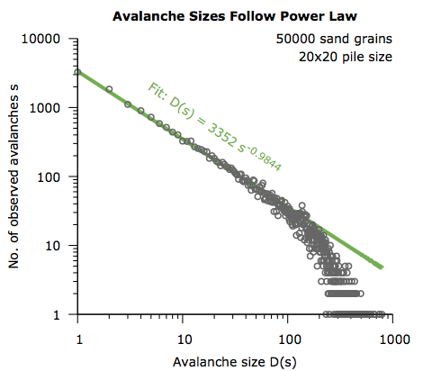
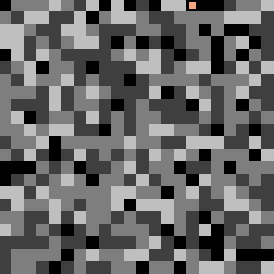
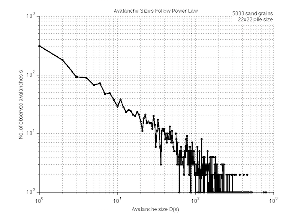

Visual Bak-Tang-Wiesenfeld Sandpile Model for Matlab
====================================================
This Matlab library helps to visualize the avalanche and power law characteristics of the popular sandpile model.

The library is meant for visualizing the Bak-Tang-Wiesenfeld sandpile model and plotting the sandpile's statistics
on the fly. The visualization has been optimized for performance.

General Description of the Sandpile Model
-----------------------------------------
The Bak-Tang-Wiesenfeld sandpile model (also called *Abelian Sandpile Model*) represents a sandpile to which sand
grains are added one by one. It is described in an intuitive way in Per Bak's famous book
[How nature works: the science of self-organized criticality](https://books.google.com/books/about/How_nature_works.html?id=e5XuAAAAMAAJ).
The model gives an easily understandable example of the concept of self-organized criticality and shows how large-scale,
complex behavior can emerge from local, simple patterns in nature.

As observed in the real world, parts of a sandpile might start "sliding" off its slope when enough grains have
accumulated at a location. Once a sand grain has started its sliding movement, it might also bump into other sand grains
and cause them to slide. This event is known as "avalanche". In his research, Per Bak has observed that the number of
grains that take part in an avalanche (as a measure of the avalanche size) follows a power-law distribution.

A power-law distribution means that some quantity *D* can be expressed as some power of another quantity *s*, for
example as *D(s) = k*s^-τ*, where *τ* and *k* are constants. When plotted on a log-log plot, a power-law distribution
shows through the plotted data resembling a straight line.



The plot shown above has been created from data gathered by this sandpile model. Up to an avalanche size of 100 grains,
the data supports the claim of a power-law distribution: The data resembles a straight line, approximated by the graph
of a linear fit function shown in green.

The power-law characteristics of the sandpile system are very important for Bak's line of thought. He remarks:

> The power law indicates that the stationary state is critical.
> We conclude that he pile has self-organized into a critical state.
> -- <sub><sup>Bak, P. *How nature works : the science of self-organized criticality*. New York: Springer, 1996, 57.</sup></sub>

In this quote, the terms *critical* and *self-organized* jump out. The *critical* state, in the context of the sandpile
model, relates to how individual sand grains behave *as a group*.

A pile of sand that consists of many randomly arranged sand grains might not have a critical state. In this kind of
sandpile, any grain that is added, at any position, will probably not have global effects on the sandpile. A newly added
grain might cause a few grains to topple in its neighborhood, but there is no remarkable pattern of topples or
avalanches this grain causes.

However, a sandpile that is in a critical state is different. In such a sandpile, a grain that is added at a random
position will eventually cause global effects in the sandpile. The added grain might start an avalanche of toppling
processes that change the entire geometry of the sandpile, reaching far beyond the local domain. For a sandpile that
has a typical conical form, the critical state is reached when its slope has reached a certain angle. Keeping all
parameters the same and adding more sand grains, sand sliding off its slope will prevent the sandpile's slope angle
from becoming any steeper.

To put it in Bak's words: In a non-critical state, individual grains follow their own local dynamics, while in a
critical state, the emergent dynamics are global. In the critical state, a pattern emerges from the observation of the
sandpile: Avalanche sizes (and other measurable quantities) show a power-law distribution.

The sandpile does organize itself without external influences into the critical state. It is entirely *self-organized*.
This means that even if grains are initially distributed randomly and not in a specific way triggering a critical state,
the sandpile will show critical behavior after adding a certain number of sand grains to arbitrary positions.

How This Sandpile Model Works
-----------------------------
In this sandpile model, the sandpile is built onto a square grid of a specified `pile_width` The total number of
positions in the square grid is `pile width * pile width`, so for a sandpile with a `pile_width` of 12, 144 grid
positions are available.

On every grid position, an arbitrary amount of sand grains can be stacked. However, if the number of sand grains on a
grid position is greater than or equal to 4, a toppling event takes place, originating at that grid position.

In a toppling event, four grains get taken away from the originating grid position and are distributed equally among the
neighboring grid positions north, east, south, and west of the originating grid position. As a result, the originating
grid position possesses four grains less, while the number of grains on all its four neighboring positions has increased
by one. This behavior eventually leads to a chain reaction, in which a further toppling event on one of the neighboring
positions is caused. Such a chain reaction is called "avalanche". If, through a toppling event, a sand grain is to be
added to a position beyond the boundary of the pile, it is ignored and no longer considered in the model. This can be
imagined as a sand grain "falling off" the surface on which the sandpile is created.

In this model, new sand grains are added to random grid positions. The sand grains are added one by one, except during
toppling or avalanche events. In this case, no grains are added until these events are over. The model is initialized
with a random number of up to 3 grains at every grid position. (As noted [before](#general-description-of-the-sandpile-model),
this random initialization is not necessarily critical, the critical behavior evolves over time.)

Matlab Plots for Visualization
------------------------------
During execution of this script, Matlab visualizes the sandpile by means of a sandpile plot and a plot showing the
avalanche size distribution. The sandpile plot can be turned off to increase performance.

### Sandpile Plot
A sample of the sandpile plot is shown in the picture below. The plot shows a "top view" of the entire pile. The
pile has a width of 22 positions, so 22*22=484 positions in total. A square is shown for every grid position. The
lighter the square in color, the more grains are stacked on the grid position. On the color scale, there is no
discrimination between positions that have four and more grains, all of them are white. A black square indicates that
there are no grains placed on that position.

The peach-colored square overlaying a grid position shows the location where the most recent sand grain is dropped. The
square is not shown during an avalanche.

The sandpile plot is updated automatically as the model is running.



### Plot of Avalanche Sizes
The plot of avalanche sizes is a log-log plot that is created and updated as the model runs. It shows the quantity of
avalanches and their sizes. In this model, the size of an avalanche is defined as the number of direct and indirect
toppling events that were caused by the addition of a single sand grain to the pile.

Through the log-log scale the plot enables an assessment of whether the avalanche distribution follows a power law. As
there are note many observations for the biggest avalanches, the plot usually shows some clutter for the biggest
avalanches.



Usage
-----
The code is thoroughly documented, the documentation can be accessed through the `doc simulateSandpile` command. To run
the model, call the `simulateSandpile` function, the only user-facing function in the script.

Configurable **input** parameters of `simulateSandpile` are:

* `pile_width`: Side length of the square pile

* `no_of_grains`: Number of grains that are added one by one to the sandpile as the model runs. The simulation stops
after the specified number of grains has been added.

* `draw_speed`: Speed of animation of the plots. A speed of 0 skips the sandpile animation entirely, and will only plot
a chart of avalanche sizes once the simulation has finished running. A value of 0.5 yields a relatively slow animation, smaller
values yield a faster one.

The following code is a simple usage example:
```matlab
pile_width = 40;      % Pile represented through 40x40 grid
no_of_grains = 4000;  % Run the simulation until 4000 new sand grains have been added
draw_speed = 0.2;      % Animate the pile relatively slow
avalanche_output = simulateSandpile(pile_width, no_of_grains, draw_speed);
```

The `simulateSandpile` function returns a single **output** variable, `avalanche_output`. This variable is a matrix with
the shape *max. avalanche size x 2*. The matrix contains information about how many avalanches with a specific size
occurred during the run. ([The avalanche plot description](#plot-of-avalanche-sizes) shows how the avalanche size is
defined in this model.)

Here is an annotated example of a typical `avalanche_output`:
```matlab
% Content of avalanche_output:
[1 50;   % 50 avalanches causing 1 toppling event
 2 32;   % 32 avalanches causing 2 toppling events
 3 11;   % 11 avalanche causing 3 toppling events
 ...];
```

Download
--------
An archive with the library can be downloaded from the [releases page](https://github.com/flrs/visual_sandpile/releases).

Installation
------------
To install the library, extract all files into a folder and add them to your Matlab path.

Contribution
------------
I am happy about any contribution or feedback. Please let me know about your comments via the Issues tab on
[GitHub](https://github.com/flrs/visual_sandpile/issues).

Acknowledgements
----------------
The main source of inspiration for writing this library is Per Bak's book
[How nature works: the science of self-organized criticality](https://books.google.com/books/about/How_nature_works.html?id=e5XuAAAAMAAJ).

The function `rldCumsumDiff` that repeats copies of array elements is taken from [a post byDivakar's on stackoverflow.com](http://stackoverflow.com/a/29079288/2778484).

License
-------
The Visual Bak-Tang-Wiesenfeld Sandpile Model for Matlab is distributed under the [MIT License (MIT)](https://github.com/flrs/visual_sandpile/blob/master/LICENSE.md).
